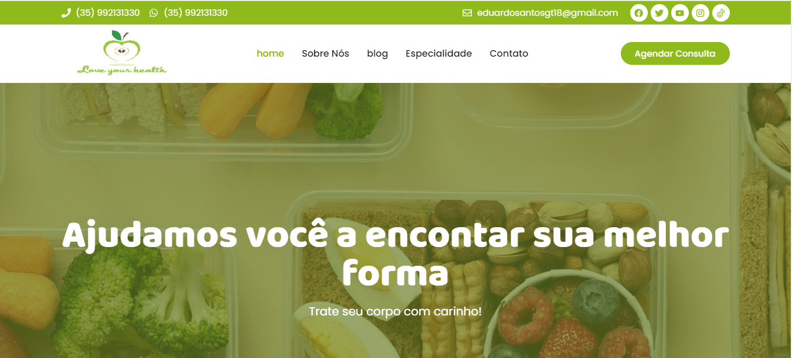

<h1 align="center" background-color="green">Love your health</h1>

Site para desenvolvimento pessoal e se aperfeiçoar mais em HTML e CSS.

  <a href="#-tecnologias">Tecnologias</a>&nbsp;&nbsp;&nbsp;|&nbsp;&nbsp;&nbsp;
  <a href="#-projeto">Projeto</a>&nbsp;&nbsp;&nbsp;|&nbsp;&nbsp;&nbsp;
  <a href="#memo-licença">Licença</a>

  

 

  

## 🚀 Tecnologias

Esse projeto foi desenvolvido com as seguintes tecnologias:

- HTML e CSS
- Git e Github

## 💻 Projeto

O Love your Health é um site de nutrição para ta dando dicas de como ter sua alimentação saudevel, como alcançar deu ojetivo, melhoria de qualidade de vi, aprender sobre nutrição e qualquer problema que estiver está procurando a nossa especialidade para mais informais.

## :memo: Licença

Esse projeto está sob a licença MIT.

---
<h3 align="center" background-color="green">Feito com ♥ by Eduardo Santos</h3>

